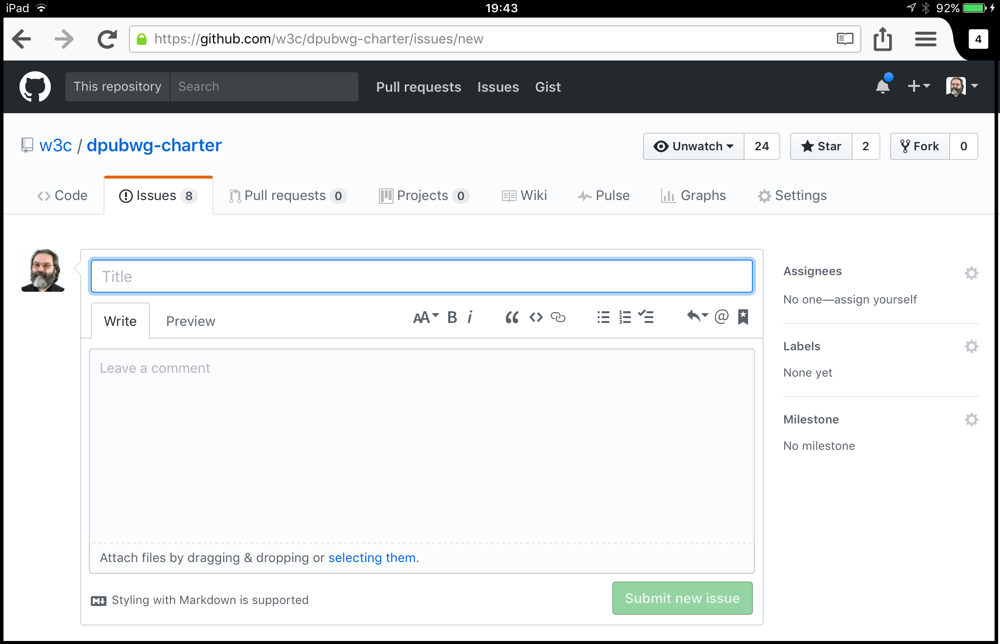
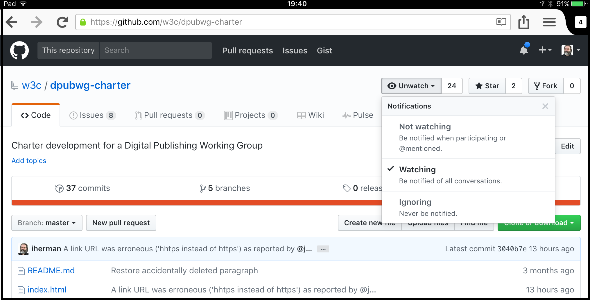

# Introduction to Basic GitHub Contribution

Many first-time users are intimidated by Git and GitHub, and they are indeed not simple tools. Most of the guides out there concentrate on how one does contribute to the documents, sources, etc, on a GitHub repository, how to change, commit, etc. However, in groups (like W3C Working Group) there may be a number of participants who would like first to understand what the basics are to raise issues, comment on them, notified about them: this is, for many, the first step in collaborating. This introduction is for them.

[GitHub](https://guides.github.com/features/issues/) are a way to comment on documents or other sources, and have threads of discussions. Issues can be labelled, referred to via a URL, and GitHub offers powerful ways of searching through the issues. As a consequence, many groups prefer to use the GitHub issue facilities to manage comments. Here are the steps that you have to follow to get up to speed quickly.

1. [Get a GitHub account](#getgh)
1. [Issue creation and commenting](#iss)
	1. [Create a new issue](#newiss)
	1. [Comment on an issue](#comiss)
1. [Be notified!](#notif)
	1. [Set up your notification preferences](#notpref)
	1. [“Watch” a specific repository](#watch)
1. [Bonus: combining email with issue commenting](#email)

## [Get a GitHub account](id:getgh)

If you haven't yet, get yourself an account. You will have to choose a nickname, and provide an email address, too. The email address may used for various notifications (see below) so use an email address that you use regularly for your work, too.

> The nickname is also a powerful tool to refer to another person in an issue, a comment, etc. E.g., if my nickname (iherman) appears in the form `@iherman` in an issue and/or a comment, I am notified of that comment, and an active link to my profile is also automatically generated in the comment on-line. It has become a habit on GitHub to use the nickname rather than one’s name in a comment.

## [Issue creation and commenting](id:iss)

### [Create a new issue](id:newiss)

Nothing could be simpler. Go to the repository, look for the tab `Issues` and then push the `New Issue`. You will get something like this:

Give a suitable title, type your issue in the edit box, and push the 'Submit New Issue' button. That is it.

The edit box understands the [markdown syntax](https://guides.github.com/features/mastering-markdown/), and the content will be displayed properly formatted.

> You do not necessarily have to understand all the details of the syntax; the edit box has some helping buttons if you want to change the font size, etc.

An issue can also be categorized ("labelled") although you do not necessarily have the right to label the issue yourself (this has to be done by those who have an “admin” right to that repository).

The issues are automatically numbered by GitHub, and given a URL of the form `https://github.com/{repository name}/issues/25`. As further help, you can refer from one issue (and its comments) to another within the same repository by simply typing, e.g., `#25`; GitHub expands this into the issue URL.

### [Comment on an issue](id:commiss)

You can “open” and issue by using its URL, and you can then add a comment on the issue. The page displayed by GitHub automatically creates a similar edit area than for a new issue: just type into it, and push “Comment”. See the figure below as an example

You can also decide to close an issue (for example, because your question was answered); closed issues are displayed separately, but they are **not** removed (and can be re-opened at any time).

Actually, reacting on an issue may be even simpler; [it can be done by email](#email)! However, that requires some more step on notifications first.

## [Be notified!](id:notif)

Creating and commenting on issues is fine, but you have to know that there is something interesting happening. For that, some prefer to receive automatic notifications via emails. This includes two steps:

1. Set up your notification preferences
2. “Qatch” a specific repository

### [Set up your notification preferences](id:notpref)

This can be done in your personal setting; these can be reached by through the pull down menu on the upper right hand corner of the screen where your avatar should appear. Look for “Settings”. Once you are there, look (usually on the left hand side) at “Notifications”.

You will see different choices. You can choose “email” for

* “Participating”, i.e., to be notified if anything occurs on an issue you raised, or if your GitHub nickname is mentioned
* ”Watching”, i.e., to be notified if anything occurs on a repository that you decided to “Watch” ([see below](#watch))

> In case you choose for email notifications you can also set which events you will be notified on exactly; I would suggest to set all options, they can be removed later.

As an example, here is how my notification settings look like:

### [“Watch” a specific repository](id:watch)

That is easy: if you go to a repository page you are interested it, look for the pull-down menu on the top that says “Watch”, and choose the option you prefer.  

## [Bonus: combining email with issue commenting](id:email)

The advantage of using a notification is that you do not only receive an email on any new issue raised or commented upon, but you can also use your client for adding a new comment.

An email coming from github can be easily recognized (see illustration):

* the `To:` header is set to the repository name
* the subject line reflects the title and number of the relevant issue
* the footer of the mail includes a link to the issue itself.

If you receive such a mail, and you want to comment, you have two possibilities

1. you use the link in the footer to go to the Web interface
2. you *reply* to this mail with your comments; GitHub will insert your reply as a bona fide comment to the issue, just as if you did it directly.

> It is good practice to remove your automatic signature, if any, from the returned email
